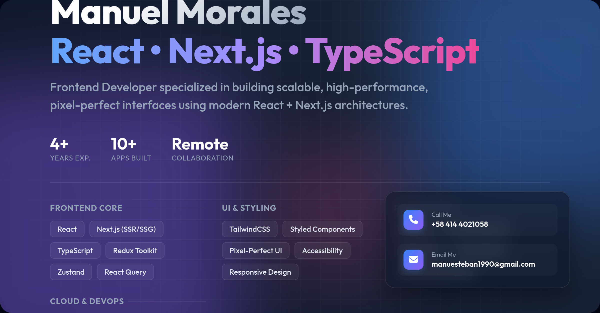

# 🧾 CV PDF Generator

This small Node.js application generates a professional PDF version of your **Curriculum Vitae (CV)** in **English** or **Spanish** using simple commands.  
It’s currently tailored for personal use but may evolve into a more general tool for generating customizable CVs in the future.

---

## 🚀 Features

- 📄 Generates your CV as a **PDF**
- 🌍 Supports **English** and **Spanish** versions
- ⚙️ Simple to run using Node.js
- 🧩 Clean and extensible structure for future enhancements

---

## 🛠️ Installation

Clone the repository and install the dependencies:

```bash
git clone <your-repo-url>
cd <your-repo-folder>
npm install
```

---

## 💡 Usage

To generate the **English version** of your CV:

```bash
node generate-pdf.js
```

To generate the **Spanish version** of your CV:

```bash
node ./es/index.js
```

To generate the **Spanish short version** of the CV:

```bash
node es/index-short.js
```

### Harvard Style (XYZ Method)

To generate the **English Harvard version**:

```bash
npm run build:harvard
```

To generate the **Spanish Harvard version**:

```bash
npm run build:harvard:es
```

After running either command, a PDF file will be created in the project directory.

---

## 🧰 Tech Stack

- **Node.js**
- **PDF generation library** (such as `pdfkit` or `reportlab`, depending on your implementation)
- **JavaScript / ES Modules**

---

````

### Social Media Banners

To generate the **English banner**:

```bash
npm run generate:banner:en
```

To generate the **Spanish banner**:

```bash
npm run generate:banner:es
```



### Letter of Recommendation Generator

To generate a **Letter of Recommendation in English** (interactive prompts for recommender and recommended person details):

```bash
npm run generate:recommendation:en
```

To generate a **Letter of Recommendation in Spanish** (interactive prompts for recommender and recommended person details):

```bash
npm run generate:recommendation:es
```

Both commands will:
- Prompt for recommender name, recommended person name, phone number, LinkedIn/website link, job titles, company, and ID card
- Generate both PDF and DOCX formats
- Create professional letters with signature fields and complete contact information

---

## 🧰 Tech Stack

- **Node.js**
- **Puppeteer** (for PDF & Image generation)
- **HTML/CSS** (for styling CVs and Banners)
- **docx** (for DOCX generation)

---

## 📈 Future Improvements

- Add customizable templates
- Support for different color themes or layouts
- Include more languages
- Create a simple web interface

---

## 👨‍💻 Author

**Manuel Morales**
Full Stack Developer — MERN | Azure | PostgreSQL | Laravel | WordPress
[LinkedIn](https://www.linkedin.com/in/manuel-esteban-morales-zuarez-68573b189/)
````
