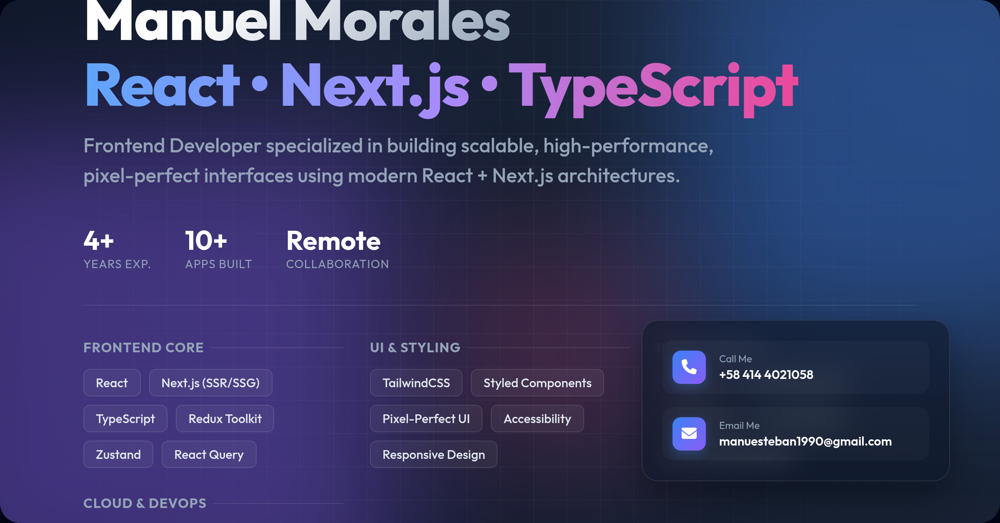

# 🧾 CV PDF Generator

This small Node.js application generates a professional PDF version of your **Curriculum Vitae (CV)** in **English** or **Spanish** using simple commands.  
It’s currently tailored for personal use but may evolve into a more general tool for generating customizable CVs in the future.

---

## 🚀 Features

- 📄 Generates your CV as a **PDF**
- 🌍 Supports **English** and **Spanish** versions
- ⚙️ Simple to run using Node.js
- 🧩 Clean and extensible structure for future enhancements

---

## 🛠️ Installation

Clone the repository and install the dependencies:

```bash
git clone <your-repo-url>
cd <your-repo-folder>
npm install
```

---

## 💡 Usage

### Unified Build & Validation (Recommended)

To build **all CV versions** simultaneously in ~10 seconds:

```bash
npm run build:all
```

To compile all CVs and **validate page budgets** (strict 1-page for short format, 2-page for Harvard):

```bash
npm run validate
# or
npm test
```

### Individual CV Generation

- **English Standard CV**:
  ```bash
  npm run build:cv:en
  ```
- **Spanish Standard CV** (Long canvas):
  ```bash
  npm run build:cv:es
  ```
- **Spanish Short CV** (A4 single-page):
  ```bash
  npm run build:cv:es:short
  ```
- **English Harvard ATS CV**:
  ```bash
  npm run build:harvard
  ```
- **Spanish Harvard ATS CV**:
  ```bash
  npm run build:harvard:es
  ```

---

## 🤖 AI Agent Harness (Gemini & Multi-Agent)

This repository includes a specialized AI harness:
- **`GEMINI.md`**: Complete system context, synchronization rules, and layout constraints for Gemini and Antigravity.
- **`AGENTS.md`**: Universal agent operational guidelines.
- **`.agents/rules/`**: Progressive rule definitions for autonomous pair programming.

---

### Social Media Banners

To generate the **English banner**:

```bash
npm run generate:banner:en
```

To generate the **Spanish banner**:

```bash
npm run generate:banner:es
```



### Letter of Recommendation Generator

To generate a **Letter of Recommendation in English** (interactive prompts for recommender and recommended person details):

```bash
npm run generate:recommendation:en
```

To generate a **Letter of Recommendation in Spanish** (interactive prompts for recommender and recommended person details):

```bash
npm run generate:recommendation:es
```

Both commands will:
- Prompt for recommender name, recommended person name, phone number, LinkedIn/website link, job titles, company, and ID card
- Generate both PDF and DOCX formats
- Create professional letters with signature fields and complete contact information

---

### PVC Pipes Flow Diagram Generator

To generate the **PVC Pipes Flow Diagram** (PDF and DOCX formats):

```bash
npm run build:diagram
```

This command will:
- Read `DiagramaTuberiasPVC.html` which contains a Mermaid.js flowchart and a 5M Analysis grid.
- Render the diagram and generate a single-page landscape PDF.
- Extract the text and diagram image to generate an editable DOCX file preserving the original content layout.

---

## 🧰 Tech Stack

- **Node.js**
- **Puppeteer** (for PDF & Image generation)
- **HTML/CSS** (for styling CVs and Banners)
- **docx** (for DOCX generation)

---

## 📈 Future Improvements

- Add customizable templates
- Support for different color themes or layouts
- Include more languages
- Create a simple web interface

---

## 👨‍💻 Author

**Manuel Morales**
Full Stack Developer — MERN | Azure | PostgreSQL | Laravel | WordPress
[LinkedIn](https://www.linkedin.com/in/manuel-esteban-morales-zuarez-68573b189/)
